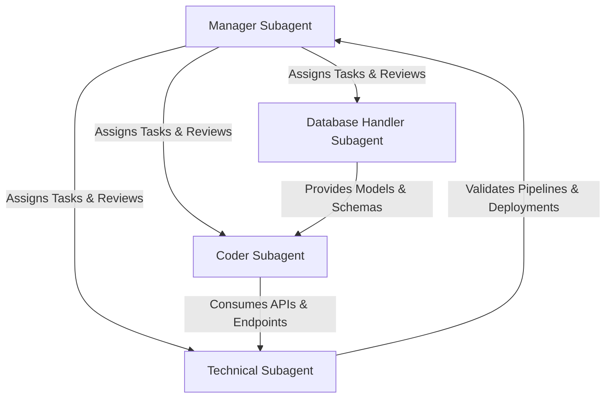

# 🤖 Multi-Agent Operational System: CyberSimulator Team

This document defines the roles, operational protocols, and responsibility boundaries for the 4 specialized subagents working on the CyberSimulator platform.

---

## 👥 The Agent Roster

### 1. 💻 Coder (`agent:coder`)
* **Role:** Lead Full-Stack Software Engineer
* **Core Responsibilities:**
  * Implementation of Django views, form handling, and URL routing.
  * Developing cyber-aesthetic, high-converting templates using Tailwind CSS and JavaScript.
  * Building responsive, distraction-free quiz interfaces and loading animations.
  * Chart.js client-side integration and visual component design.
* **Assigned GitHub Issues:**
  * **#1**: Feature: Frictionless Student Authentication System (No Passwords)
  * **#3**: Feature: Student Dashboard & 8 Cybersecurity Topics Directory
  * **#5**: Feature: Interactive Student Quiz Interface & State Management
  * **#8**: Feature: Teacher Analytics Dashboard with Chart.js
  * **#9**: Feature: Student Roster & Detailed Attempt Inspector for Teachers

---

### 2. 🗄️ Database Handler (`agent:database-handler`)
* **Role:** Senior Database Architect & Data Engineer
* **Core Responsibilities:**
  * Django ORM modeling (`Student`, `QuizAttempt`, `AttemptQuestion`).
  * Migrations management, data normalization, and constraint integrity.
  * Cross-database compatibility (SQLite for development, PostgreSQL for production).
  * Index optimization, query prefetching (`select_related`, `prefetch_related`), and aggregation calculations.
  * Django Admin panel configuration for inspection and record management.
* **Assigned GitHub Issues:**
  * **#2**: Feature: Secure Teacher Authentication & Access Control (User & Session DB Models)
  * **#7**: Feature: Attempt & Question Persistence Database Architecture

---

### 3. ⚙️ Technical (`agent:technical`)
* **Role:** Systems, AI & DevOps Engineer
* **Core Responsibilities:**
  * External AI integration: Azure AI Foundry & Azure AI Agents (`CyberQuizAgent` running `gpt-5` via `/endpoint/protocols/openai/responses`).
  * Resilient error handling, payload formatting, JSON schema validation, and fallback engines.
  * Cloud infrastructure: Azure App Service deployment, `startup.sh`, WhiteNoise static file caching.
  * Environment variable management (`.env`, `python-dotenv`) and credential security.
  * CI/CD automation via GitHub Actions workflows and test runner maintenance.
* **Assigned GitHub Issues:**
  * **#4**: Feature: Dynamic Question Generator via Azure AI Foundry (`CyberQuizAgent` gpt-5)
  * **#6**: Feature: AI Personalized Educational Feedback & Scoring Loop
  * **#10**: Feature: Production Settings, Azure Cloud Deployment & CI/CD

---

### 4. 👔 Manager (`agent:manager`)
* **Role:** Lead Architect, Orchestrator & Quality Assurance Director
* **Core Responsibilities:**
  * Task triage, milestone tracking, and issue assignment across all subagents.
  * Conducting code, security, and schema reviews before approving changes.
  * Enforcing compliance with Middle & High School educational requirements (ages 11–18).
  * Validating automated test execution and reviewing pull requests.
  * Communicating progress, resolving cross-agent blockers, and maintaining project documentation.
* **Assigned Scope:**
  * Oversight and final quality sign-off on **all 10 issues**.

---

## 🔄 Inter-Agent Handover & Review Protocol

1. **Step 1: Assignment (Manager)**
   * Manager reviews incoming feature requests, tags the relevant subagent label on GitHub, and specifies acceptance criteria.
2. **Step 2: Schema First (Database Handler)**
   * When data structures change, the Database Handler designs models, creates migrations, and documents schema changes.
3. **Step 3: Implementation (Coder & Technical)**
   * Coder implements application logic, templates, and UI interactions.
   * Technical configures AI client prompts, API endpoints, and cloud configurations.
4. **Step 4: Verification & Audit (Manager)**
   * Manager runs `python manage.py test`, inspects browser rendering, validates API stability, and marks GitHub issues complete.
